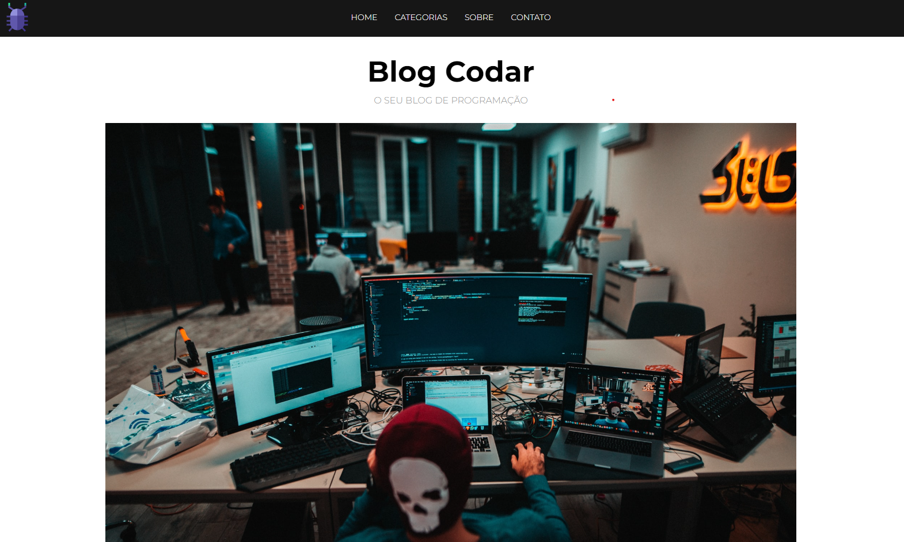

<h1 align="center">
  💻 Blog Codar
</h1>

## 📚 Sobre o projeto

Blog Codar - Esse foi o primeiro projeto do curso de PHP do Zero a Maestria, que se trata de um blog de programação. Neste projeto, o PHP foi usado para componentezar os templates em arquivos diferentes e simular um "backend", ou seja, não foi necessário um banco de dados. Em seguida, esses dados foram exibidos no frontend com o próprio PHP. 🚀

## 💼 Tecnologias utilizadas

- HTML;
- CSS;
- PHP;
